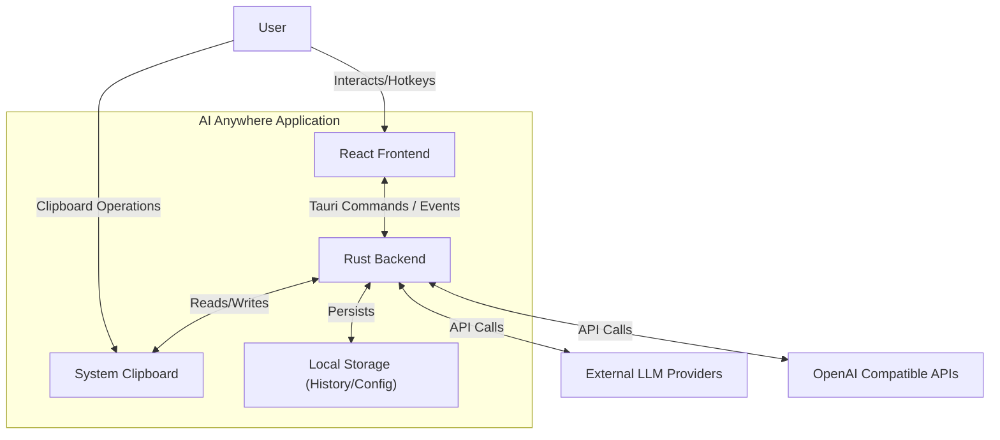
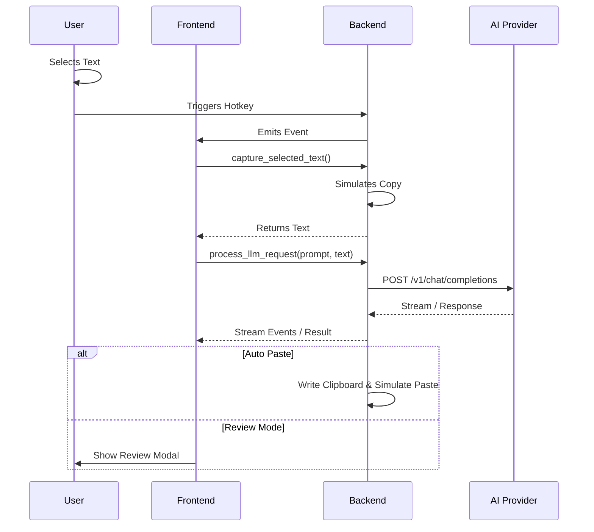

# Software Architecture

## 1. Overview

**AI Anywhere** is a desktop application built using [Tauri 2.0 framework](https://tauri.app/). It allows users to integrate AI capabilities (LLM, Image Generation, Speech-to-Text) directly into their workflow via global hotkeys and clipboard integration.

The application follows a **Client-Server** model where:
- The **Client** is a React-based frontend running in a system WebView.
- The **Server** is a Rust-based backend running as the main application process.

## 2. System Architecture

The system consists of three main parts: the User Interface (Frontend), the Core Logic (Backend), and External AI Services.



## 3. Backend Design (Rust)

The backend is responsible for system-level operations, business logic, and secure API communication. It resides in the `src-tauri` directory.

### Core Modules (`src-tauri/src/`)

| Module | Description |
|--------|-------------|
| `lib.rs` | **Faceade / Entry Point**. Initializes the application, sets up the system tray, menus, and exposes `#[tauri::command]` functions to the frontend. |
| `llm.rs` | **Service Layer**. Handles all HTTP communication with OpenAI-compatible APIs. Implements streaming and non-streaming request processing. |
| `clipboard.rs` | **System Integration**. Manages clipboard reading/writing, simulates keyboard events (Ctrl+C/V), and handles window focus restoration. |
| `config.rs` | **Configuration Management**. Handles loading/saving application settings. |
| `encryption.rs` | **Security**. Provides encryption/decryption routines for securely storing API keys. |
| `history.rs` | **Persistence**. Manages the storage and retrieval of user interaction history (prompts and responses). |
| `custom_tasks.rs` | **Feature Module**. Manages user-defined tasks/prompts (CRUD operations). |
| `operations.rs` | **Business Logic**. Defines built-in operations (e.g., "Fix Grammar", "Summarize"). |

### Key Responsibilities
1.  **API Communication**: The backend acts as a proxy to LLM providers, protecting API keys and handling network errors.
2.  **Global Shortcuts**: Listens for system-wide hotkeys to trigger app visibility or recording.
3.  **Clipboard & Input**: Can programmatically simulate copy/paste to read from or write to other applications.

## 4. Frontend Design (React)

The frontend provides the user interface for configuration and interaction. It allows users to invoke AI tasks when the global hotkey isn't used or when further input is needed. It resides in the `src` directory.

### Technology Stack
-   **Framework**: React (with TypeScript)
-   **Build Tool**: Vite
-   **Styling**: Tailwind CSS v4
-   **Routing**: Custom Component-based switching (Single Page Application)

### Core Components (`src/`)

| Component/Directory | Description |
|---------------------|-------------|
| `main.tsx` | Application entry point. Mounts the React root. |
| `context/AppContext.tsx` | **Global State**. Manages application-wide state (configuration, current tab, history items) using React Context API. |
| `components/pages/` | Contains main views: `HomePage` (Main UI), `HistoryPage` (Logs), `SettingsPage` (Config), `CustomTasksPage`. |
| `components/ReviewModal.tsx` | displayed when `PasteBehavior` is set to "Review". Allows editing AI response before pasting. |
| `hooks/` | Custom hooks bridging Backend and Frontend. e.g., `useGlobalShortcut` listens for Rust-emitted events. |

## 5. Data Flow

### 5.1. Standard Text Processing Workflow

1.  **Trigger**: User presses Global Hotkey (or clicks UI button).
2.  **Capture**:
    -   Frontend asks Backend to `capture_selected_text`.
    -   Backend simulates `Ctrl+C` and reads the clipboard.
3.  **Request**:
    -   Frontend sends `LlmRequest` (prompt + captured text) to Backend via `process_llm_request` (or streaming variant).
4.  **Processing**:
    -   Backend `LlmService` constructs the API request (injecting System Prompts).
    -   Backend calls External API.
5.  **Response**:
    -   Backend receives response.
    -   **If Streaming**: Emits `llm-stream-chunk` events to Frontend.
    -   **If Complete**: Returns `LlmResponse`.
6.  **Output**:
    -   **Auto-Paste**: Backend writes to Clipboard, restores window focus, simulates `Ctrl+V`.
    -   **Review**: Frontend displays `ReviewModal` for user action.



## 6. Data Persistence

-   **Configuration**: Stored in JSON format on the local filesystem (OS-specific AppData directory). API Keys are encrypted before storage.
-   **History**: JSON-based storage of past interactions. Includes prompts, responses, and metadata. Media files (images/audio) are stored in a dedicated `media` subdirectory.
-   **Custom Tasks**: Stored as a JSON list, defining custom system prompts and parameter options.

## 7. Security Considerations

-   **API Key Storage**: API keys are encrypted at rest using platform-specific keys or a generated local key to prevent plain-text exposure in config files.
-   **Input Validation**: Prompt length is estimated and validated on both Frontend and Backend (`MAX_ESTIMATED_TOKENS`) to prevent massive API usage.
-   **Vulnerability Mitigation**: The app is built with Tauri's security hardening (Isolation pattern, scoped filesystem access).

## 8. Directory Structure

```
AIAnywhere/
├── src/                # Frontend (React)
│   ├── components/     # UI Components
│   ├── context/        # State Management
│   ├── hooks/          # Custom Hooks (Tauri interop)
│   └── i18n/           # Translations
├── src-tauri/          # Backend (Rust)
│   └── src/            # Rust Source Code
│       ├── lib.rs      # Main commands & setup
│       ├── llm.rs      # AI Service
│       └── ...         # Feature modules
└── docs/               # Documentation
```
